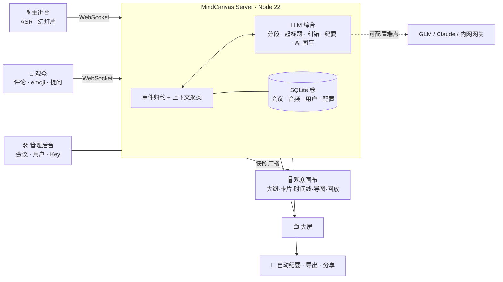

# MindCanvas · 实时会议 Agent

把「一人讲、几百人听」的单向广播，变成一块实时把群体声音**收敛成连贯内容**的协作认知画布。

> 真正的壁垒不是转录 + 摘要，而是 **many-to-one 的实时综合**：在中心把几百个声音收敛成一份连贯、可读、可参与的东西，再向几百端廉价广播。

## 架构



> 贵的推理只在中心做一次，渲染结果向几百端廉价广播。

## 特性

- 🎤 **实时语音 → 画布**：流式 ASR → 自动分段起小标题 → 大纲 / 卡片 / 时间线 / 思维导图 / 回放 多视图
- 👥 **观众收敛**：匿名评论 / emoji / 提问，几百条声音实时上下文聚类，不刷屏；弱网断点续传
- 🤖 **AI 同事**：多身份 Agent 不定时评论并回应真实观众
- 🔎 **资料补充**：联网检索（web）或**离线本地文件检索**（local，支持 Word/PDF/PPT/txt/md）
- 📝 **会议纪要**：每分钟自动生成，只留支撑逻辑链的高信息量内容 + 行动项/决议/待办；可导出 / 分享
- 🛠 **管理后台**：账号登录、会议生命周期（仅后台可结束/归档）、用户管理、音频与数据持久化
- 🔌 **可配置引擎**：智谱 GLM / Claude / 任意 OpenAI 兼容内网网关；不配也能以启发式模式运行
- 📦 **自包含**：Node 22 + 内嵌 SQLite + WebSocket，唯一依赖 `ws`；无需数据库/Redis

## 快速开始（Docker）

```bash
cp .env.example .env      # 改密码/端口；Key 可留空，启动后在 /admin 配置
docker compose up -d --build
```

打开 `http://localhost:8080`（带房间号，如 `/?room=demo`）。详见 **[DEPLOY.md](DEPLOY.md)**。

## 入口

| 入口 | 路径 | 登录 |
|---|---|---|
| 观众画布 | `/?room=<房间号>` | 免登录 |
| 大屏展示 | `/screen?room=<房间号>` | 免登录 |
| 主讲台 | `/speaker?room=<房间号>` | 需登录 |
| 管理后台 | `/admin` | 需登录（管理员） |

## 离线 / 内网部署

无外网环境可用 **Releases** 里的离线镜像包 `mindcanvas-offline-amd64.tgz`（含完整镜像，`docker load` 即用，零联网）；资料补充可切到本地文件检索（`MINDCANVAS_SEARCH_MODE=local`）。详见 [DEPLOY.md](DEPLOY.md) §6。

## 文档

- **[DEPLOY.md](DEPLOY.md)** — 部署文档（Docker / Node、配置项、内网离线、运维、安全）
- **[USAGE.md](USAGE.md)** — 使用说明（开会流程、各视图、AI 同事、资料补充、纪要、生命周期）

## 安全

镜像 **keyless**：API Key 不烤进镜像，运行时在 /admin 配置（持久化到数据卷）或经 `.env` 注入。首次启动后请尽快修改默认 `admin` / `speaker` 密码。
